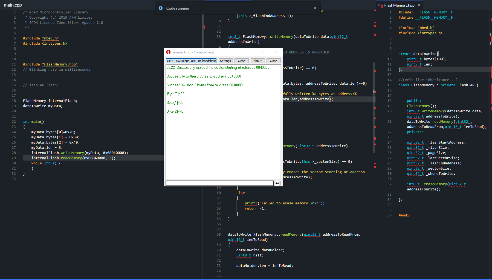

# WORK IN PROGRESS

## mbed os Internal Flash
 A quick program to write/read from internal flash memory with mbed os

## Update 22.03.2022
Working version

<figure>

<figcaption>Figure 3: Layout</figcaption>
</figure>

Yet to implement:

1. Send/read data from UART
2. Checks/protection against writing at wrong blocks of memory
3. Error function
4. More to be added later.